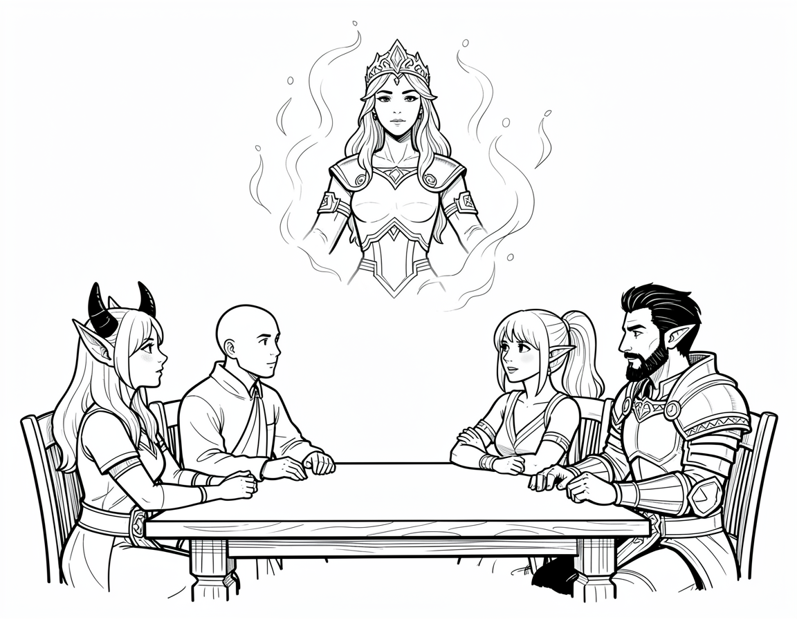

# Chapter 4: The Queen's Mission

The heroes led a very tired Suhlur, along with the missing townspeople, out of the woods and back into the town of Carraigport. Laird Marvyn was waiting in his office, pacing back and forth nervously. When he saw them return with the old wizard and the dark crystal wrapped tightly in cloth, he nearly fainted with relief.

"You really did it!" the Laird gasped. "The missing people!"

"We did," Caryndal said, giving a sweeping bow. "It was quite heroic."

Suhlur leaned heavily against the Laird's large wooden desk. "I must contact the High Queen," he rasped, his voice weak. "She needs to know what has happened to her dangerous Shard."

Suhlur lifted a shaky hand and chanted a few strange, magical words. The air above the desk began to shimmer and glow with a soft blue light. Suddenly, the glowing light formed the shape of a regal woman wearing a beautiful crown. It was High Queen Alicia Kendrick, communicating with them through the magical spell!

The Queen looked back at them through the spell. "Suhlur? Is that you? What has happened?"

Eryneth stepped forward bravely. "Your Majesty, we found Suhlur. He was being controlled by the dark magic of the Shard of Kazgoroth. We broke the spell, but the shard is dangerous."

"Yes," Aknemeia added, stepping next to Eryneth. "The crystal is safe for now. I wrapped it up so it can't whisper to anyone anymore."

The Queen's shoulders relaxed a little, and she offered them a grateful smile. "You handled the Shard without falling to its temptation? That is truly brave. Thank you all for keeping my people safe." 

"We are happy to help," Szeth stated. "But there is another problem. A boy named Gregory was captured by raiders."

The Queen gasped with surprise. "Gregory? My son! The raiders took him?"

The heroes looked at each other in shock. The bossy boy from the ship was the Queen's son?!

"We saw the man who took him," Caryndal said gently. "His name was Ulfrik. His ship, the *Grey Wolf*, sailed away."

"Ulfrik," the Queen growled, her voice full of worry and anger. "I knew him. He is a Northman warrior. Perhaps this has something to do with our old conflict with his people. Long ago, Kazgoroth deceived them into conflict with our kingdom. I was able to bind Kazgoroth inside the shards with the help of Suhlur and Audrin. We each carry a shard, guarding them." She looked at Suhlur with a sad expression. "Or at least, we did. I am sorry, old friend."

"Wait," Szeth interrupted. "If you are so powerful, why didn't you just defeat Kazgoroth instead of sticking him in crystals?"

Caryndal hissed at Szeth, elbowing him to be quiet, but the Queen just offered a sad, tired smile. 

"Because we couldn't," the Queen admitted. "We didn't have the necessary magic or tools to do so. The best we could do was bind the beast inside the shards." Her expression turned serious again. "Let us return to the present. I cannot leave my kingdom without its Queen to chase Ulfrik, and I cannot leave Suhlur's Shard, nor my own shard, unprotected. Please, brave heroes, I officially hire you. Will you help me rescue my son as you rescued Suhlur?"

Caryndal puffed out his chest, stepping right into the middle of the glowing blue light. "Do not worry, Your Majesty! You can count on... The Shard Snatchers?"

The illusion of the Queen blinked slowly, looking confused. 

"That name is even worse than the last one," Szeth grumbled, crossing his arms. "We are not snatching shards. We only snatched one shard, and we don't even want it."

"There is one problem, your Majesty," Eryneth said, interrupting her friends. "We don't know where Ulfrik was headed."

"I know where to start," Alicia said. "After the conflict with the Northmen ended, Ulfrik and many of his people made a home on the island of Mintarn. I traveled there in my younger years. It is a... colorful place, full of pirates and scoundrels, and a wild forest."

"We'll be on our guard, your highness," Caryndal said with a bow. "And we'll find your son."

"Thank you, and rest well," said the image of the Queen. "For tomorrow, you set sail."

---

The next morning, the group boarded a swift new ship headed across the sea. The days on the water gave the new friends time to learn more about each other. 

Eryneth spent her days practicing her archery. She set up small wooden targets on the railing of the ship and hit the bullseye every single time with a satisfying *thwack!* Aknemeia watched the ocean waves, her innate magic warming the chilly sea breeze around her. She seemed to be deep in thought, but Eryneth did not ask why. 

But not everyone was relaxing.

"Why does your ship take so long?" Szeth announced loudly to the ship's Captain, pointing at the large sails. "Can't you just get bigger sails or make the ship more pointy?"

The Captain, a bald, dark-skinned man, glared at Szeth. "More pointy?! I've sailed this ship for twenty years! Insult my ship again, and I'll throw you overboard to swim to Mintarn yourself!"

Szeth opened his mouth to say that swimming would be even slower, but Caryndal swooped over in a flash of colorful silk. 

"Captain, my good man!" Caryndal laughed, wrapping an arm around the angry sailor. He used a tiny bit of Fey magic to make a beautiful, sweet-smelling flower appear in the Captain's pocket. "My friend here simply means your ship is so sturdy and grand, it barely feels like we are moving at all! A true masterpiece of the sea!"

The Captain grumbled, pulling the flower out of his pocket and sniffing it. "Well. I suppose she is a sturdy vessel. Try to keep your friend quiet, bard."

Caryndal sighed in relief, gently pushing Szeth away from the steering wheel. "Please, Szeth. We need the boat to get to the prince."

After a few more days of sailing, the salty sea air changed, smelling faintly of smoke and spices. The heroes gathered at the front of the ship. Rising up from the water was a bustling island. Its shore was covered in wooden buildings, docks, and hundreds of ships.

They had arrived at Mintarn. The search for the prince was on!
