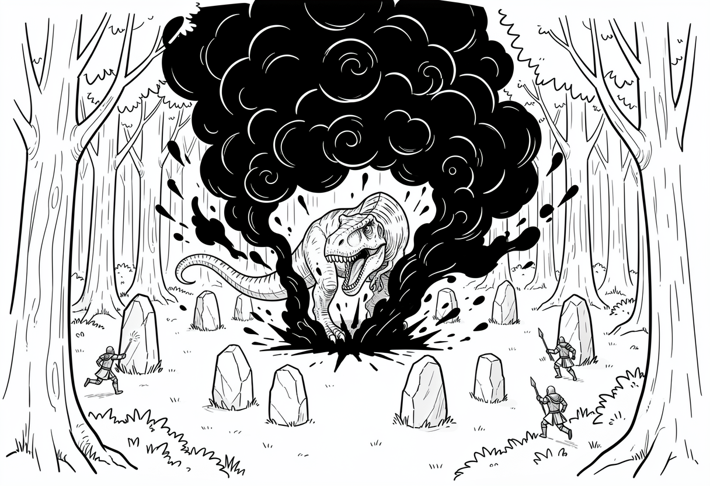

# Chapter 8: The Ritual Interrupted

The heroes huddled behind the massive fallen log, finalizing their daring rescue plan. Eryneth was fixing the string on her bow, and Caryndal was tuning his lute when Audrin stepped towards Prince Gregory in the center of the Druid's Circle. 

To the Keepers' surprise, the elven wizard pulled out a dark, pulsing crystal. It was another Shard of Kazgoroth. 

"Wait, what?" Aknemeia hissed quietly. "Is he supposed to have one of those?"

"Didn't the queen say Audrin helped her trap Kazgoroth? This must be the last shard..." Caryndal trailed off, his eyes going wide as Audrin set the shard on the ground beside Prince Gregory.

With a loud crack that seemed to echo through the entire forest, Audrin smashed his staff into the shard. The crystal shattered, and the clearing filled with thick black fog and black lightning. The dark energy spun into a vortex, reaching out like smoky fingers toward Prince Gregory in the center of the stone circle. The sky above the ancient clearing rapidly darkened, and the wind began to howl fiercely. 

"I think that's our cue!" Caryndal shouted over the roaring wind.

He leaped up onto the fallen log, playing a frantic tune on his lute. Green and gold magical notes exploded from the strings, zipping over to Eryneth and Szeth. The empowered heroes dashed away, alight with magical power.

"I've got the guards!" Aknemeia yelled, throwing her hands forward. She unleashed a dazzling barrage of magical flames. Explosions erupted throughout the clearing, followed by a shower of sticky, glowing magical webs that trapped and confused Ulfrik’s raiders.

The clearing descended into chaos, but in the center of the storm, Audrin did not flinch. He tightened his grip on his staff, his eyes locked on the swirling vortex, and continued casting the spell.

"You again?" Ulfrik growled, spotting the heroes through the black smoke and flying spells. He sliced a magical web from the air using the silver Beastslayer sword. "I must admit, your persistence is impressive! But this cannot be stopped. It has to be done!"

"We'll see about that!" Szeth roared, dashing past Ulfrik before the large Northman could react. 

Ignoring the dire warnings, the white-clad hero charged headfirst through the magical storm. Eryneth ran with him along the edge of the grove, moving with practiced grace and enchanted speed. The instant one of the raiders escaped from Aknemeia’s webs, one of Eryneth's arrows pinned their cloak to the ground or knocked their weapon from their hand, halting them in their tracks.

Szeth weaved through the chaos until he reached the center of the stone circle where Prince Gregory was sitting, surrounded by a swirling vortex of black smoke. The prince, no longer looking bored, was wide-eyed. Black tendrils of smoke seemed to grab at him.

In a flash of white, Szeth arrived, delivering a powerful kick to the tendrils. The smoke fell away, releasing the boy. Szeth grabbed the boy's collar and yanked him out of the swirling magic. 

"You're coming with me," Szeth stated, looking the boy in the eyes. For once, Gregory did not whine.

Just as they left the circle, a portion of the swirling black magic formed into a massive reptile tail, smashing into the ground where Gregory had been. 

*BOOM!* 

The earth shook, sending everyone tumbling to the ground.

The howling wind became stronger, and dark energy poured relentlessly from where the Shard had broken. As they all watched, the swirling energy solidified, taking on physical form. In a final burst of dark purple energy, Kazgoroth emerged as a colossal reptilian monster!

Kazgoroth let out an ear-splitting roar that shook the remaining leaves from the ancient trees, driving the smoke away.

As they stood up, the heroes looked around to see the scattered raiders surrounding the grove, all of them getting ready to face the impossible beast. 

Audrin and Ulfrik stood tall, and Audrin shouted out, "It's time to end this!" The mage raised his staff high, and it began to glow.

Ulfrik held the silver Beastslayer sword high into the air, and looked towards the heroes. "For the Northmen, and for honor!" he roared, his voice filled with fierce determination.

Together, the two former enemies charged toward the towering beast. 

From above the grove, Caryndal and Aknemeia surveyed the scene. Caryndal spotted Szeth, who had dragged Gregory safely out of danger and was standing to face the giant reptile. 

"I guess we're rescuing Ulfrik and Audrin now?" yelled Caryndal, dusting off his lute. He looked to his side and saw that Aknemeia had conjured a fresh ball of magical fire. She wore a mischievous grin on her face. Eryneth appeared from the other side of the grove, pulling an arrow free from the cloak of one of the raiders she'd pinned earlier. She notched the arrow in her bow, nodding to her friends. "Someone has to stop that thing," she yelled back.

The four of them had started this adventure to rescue a prince, but now they were about to battle a giant, magic reptilian beast. Things, it seemed, didn't always go as planned.
