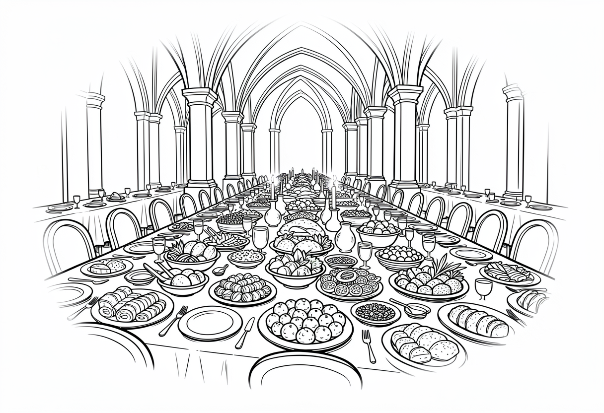

# Chapter 10: The Keepers of Mordrin

The silence in the Druid's Grove was almost as loud as Kazgoroth's roar had been moments before. The giant reptilian monster was gone. In the center of the clearing, Ulfrik still held the Beastslayer sword. He turned it in his hands, thinking. 

Around the edges of the grove, Aknemeia, Caryndal, Eryneth, and Szeth slowly lowered their weapons. They were covered in dirt and soot, but they were victorious. Prince Gregory, looking shy, was watching from behind his mossy rock.

Ulfrik finally broke the silence. He drove the tip of the Beastslayer into the soft earth and turned to face the four heroes. 

"I have fought alongside many warriors," the large Northman rumbled, his voice echoing in the quiet grove. "But I have never seen such bravery and skill as you showed today. You have my gratitude."

Audrin, the elven wizard, stepped up beside Ulfrik and bowed his head respectfully. "It is true. Without your magic and quick thinking, Kazgoroth would have defeated us."

Caryndal rested his lute on his hip, brushing a leaf from his shoulder with a dramatic flair. "Rescuing princes and battling ancient monsters is tough work, but we are professionals, after all."

Eryneth rolled her eyes, but smiled. "We did what had to be done. But..." She looked between Ulfrik and Audrin and shook her head. "Why did you do all of this? Kidnapping the prince, summoning a horrible beast? Why not just ask for help?"

"It was the only way," Audrin replied, with a serious tone. "Kazgoroth was trapped in the shards, but only temporarily. We could not wait for him to escape and cause chaos again. I felt him within my shard, and I knew that one day I would not be able to resist his power."

Ulfrik continued. "If Kazgoroth broke free, it would have been a danger to all. He tricked my people into a long conflict with his mother, and caused much destruction in the past. We had the opportunity to choose how to fight it this time."

"We needed three things," said Audrin. "Since his mother trapped the beast, Gregory's spirit could draw it out again. Together with my shard, we could summon Kazgoroth... and the Beastslayer could destroy it."

"So you used the prince as bait?" Szeth asked crossing his arms. As always, the white-clad warrior refused to sugarcoat his words. "That is terrible strategy. High Queen Alicia will be furious."

"Exactly," Audrin sighed, looking down. "The Queen would never have agreed to put her son in such danger, even to save the world. And she would never agree to risk freeing Kazgoroth, even with the Beastslayer ready. So we worked in secret. It was a terrible risk, but it was necessary."

Aknemeia crossed her arms, tiny sparks of fire dancing on her fingertips. "It was reckless! You almost lost the battle! What if we hadn't shown up?"

The atmosphere in the grove grew tense. For a long moment, the heroes and the Northman simply stared at one another. Finally, Ulfrik nodded slowly. 

"Perhaps you are right," Ulfrik said. "But you came to the call of justice, and the deed is done. The world is now safer." He walked over to Gregory and gently nudged the boy toward the heroes. "You should take the boy home to his mother. If we bring him, we will likely end up in chains." As he turned away, the Northman paused and looked back over his shoulder. "I and my people are in your debt. We leave the sword with you. Use it wisely."

With that, Ulfrik and Audrin gathered the raiders and vanished into the forest.

---

The heroes enjoyed some tea with Malthos and Florian back at *The Jade Dragon* before setting sail for the High Queen's castle. The journey was long and uneventful, but the peace was a welcome change from fighting a giant beast of primal magic. The gentle sea breeze and the sound of the waves were soothing.

After three days at sea, they finally spotted the royal castle through the morning mist. "I bet my mother will throw a feast," Gregory said, rushing to the ship's rail. He had been unusually quiet on the journey home, though he still complained about his damp socks and the lack of fine cheese.

"I hope so," said Szeth. "I haven't had a proper meal since we met you!"

When the group finally reached the royal palace, they were immediately rushed into the grand throne room. High Queen Alicia Kendrick leaped from her throne and sprinted down the steps, pulling her son into a tight hug. 

"Gregory!" she cried. "I am so glad you are safe!"

"Mother!" Gregory said, hugging the queen. "You wouldn't believe what happened! These people fought a giant lizard monster, and then it exploded!"

The High Queen turned to the four heroes, smiling warmly. "You have done the impossible," she said. "You found Ulfrik, rescued my son, and banished Kazgoroth. The Kendrick family, and the entire Kingdom, thank you for your heroism. From this day forward, your organization is honored in this realm." She paused, and waved to a woman with a pen and ink. "Take note of this royal favor: in all lands of the realm, these heroes are to be granted safe passage and hospitality..." She paused, looking at the four of them. "What is your organization called, exactly?"

"Ahem, one moment," said Caryndal, turning quietly to his friends. "Well? All I know is you didn't like the Clamshell Avengers, or The Shard Snatchers, or The Forest Friends."

Szeth shook his head. "Right, yeah, those were terrible."

"Well, do you have a better idea?" Caryndal said. "We're kind of on the hook here."

Szeth looked out over the city for a moment, thinking. Then he pulled a cage out of his bag and opened it. A small, black raven flew out and landed on his shoulder. "Remember Mordrin? Suhlur's... pet? I kept him," said Szeth. "so... how about The Keepers of Mordrin? He can be our mascot."

The others exchanged a look.

"I kind of like it," Eryneth agreed, a smile spreading across her face.

Aknemeia shrugged. "It'll do, I guess."

"Fine," Caryndal nodded, and with a bow and flourish, he turned to the queen. "Your Majesty, we are The Keepers of Mordrin."

---

That evening, the palace threw a celebration more grand than anything the heroes had ever seen. The tables were piled high with roasted meats, fresh fruits, and, to Gregory's delight, the absolute finest cheeses in the land. Musicians played lively tunes in the corner, though Caryndal made sure to pull out his lute and show them how it was *really* done.

Later in the evening, the four friends found themselves standing together on a balcony, overlooking the twinkling lights of the city below. The night air was cool and refreshing.

"So," Eryneth said softly, looking at her companions. "We rescued the prince. What comes next?"

Aknemeia smiled, her fiery golden eyes sparkling in the moonlight. "Whatever it is, I'm sure we can handle it. I'm in no hurry to get back to Baldur's Gate." Her friends looked at her, curious. "My dad is a strange fellow. I'll tell you another time, when I'm ready."

They were quiet for a moment, until Szeth spoke up. "Well, since we're talking about our pasts, does anyone know where I can find a bad guy with a big black sword?"

And so the Keepers of Mordrin talked, late into the night, about the past and the future.
